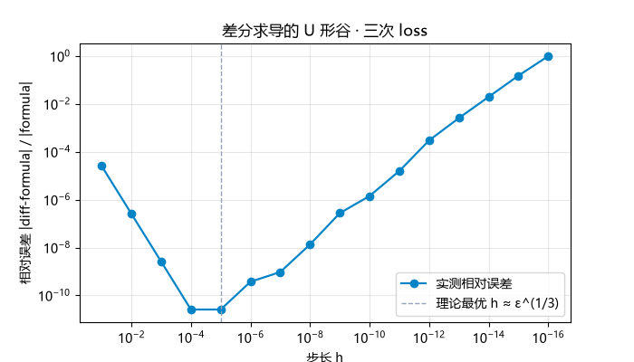

# 技博：连芙宁娜都能看懂的线性回归

> 本文将以求导为主线，用numpy串联起一元线性回归到多元线性回归的梯度下降原理，并分析为何直接差分法这样直白的方法会败给pytorch的autograd，以此对机器学习的基本方法进行数学理论的误差分析。

## 一元到多元的实现与变体

简单来说，机器学习主要分为六个流程：**①数据集获取②分块出训练集与测试集③构建预测模型④选择损失函数⑤梯度下降并训练⑥训练模型与测试集对拍**。在本章我将讲述作为大一新生在处理这六个流程上遇到的问题和解决思路。

**①数据集获取**

```python
import numpy as np
np.random.seed(0)
x=np.random.uniform(0,100,numbers)
w_r=np.random.randint(0,5)
b_r=np.random.randint(0,5)
bios=np.random.randn(numbers)*0.5
y=x*w_r+b_r+bios
```

为了保证数据的稳定，我每次就用同一个np的种子生成数据，其中numbers是你所要的数据量，在此为了衡量不同数据量时的泛化能力我取的是10,20,50,100,1000,10000,50000,100000。在这里，我一开始的bios是用uniform生成(0,1e-2)的浮点数，但如果这样就意味着y上移了5e-3，会导致理论上b一定无法和b_r相等，并且数据过大导致震荡，训练不稳定。

**②分块出训练集与测试集**

因为一元线性回归的数据集都是自己生成的，所以我们就按照上述代码在重新生成一遍
```python
xte=np.random.uniform(0,100,100)
```

**③构建预测模型**

作为一元线性回归，它的模型显然是
```python
def predict(w,x_s,b):
    return w_s*x_s+b#这里把w写在左侧是一个好习惯，在多元线性回归时有用
```

**④构建损失函数**

损失函数就是用来衡量模型与真实值的差值的，绝大多数人第一时间想到的肯定就是直接**预测值-真实值,然后求平均**但是这样会导致最后，预测值是**w×x_hat+b**,真实值是**w_r×x_hat+b_r+bios**，最后发现
预测值与真实值的差距就仅仅是平均值的差距，而平均值一是易受极端数据影响二是不能反映单个数据之间的差距，所以我们在此就要构建一个能同时用到每一个x的损失函数。
我们的第一想法就是绝对值函数，实现形式是这样的：
```python
def lossc(w,x_s,b,y):
    return (1/numbers)*abs(predict(w,x_s,b)-y).sum()
```
固然绝对值函数简单易懂，但它的问题一是函数导数在拐点处**不可导**，因此对于拐点要单独讨论；二是它的导数是**常数**，因此每次梯度下降的步长相同，难收敛。
那有没有一种函数能即排除负号，还能用到每一个x呢？有的兄弟，有的。

人们想出了**最小二乘法（MSE）**，也是机器学习最常用的损失函数之一，它的实现是这样的：
```python
def loss(w,x_s,b,y):
    return (1/numbers)*((predict(w,x_s,b)-y)**2).sum()
```
这样在求导后，根据链式法则，w的导数就带有一个**$\hat y$-y**，能让导数随着接近真实值而改变，差别大步子大，差别小步子小，自适应下降。
在之后求导的比较中，我们将用数据来说明这二者的差异。

**⑤梯度下降并训练**

这二者我就放在一起说了，我们先用公式推导出一元线性回归的导数公式，本质上是**损失函数（模型-真实值）**，因此要用到链式法则
我们令 $\hat y=\mathrm{predict}(w,x_s,b)$，那么根据链式法则，损失函数对 $w$ 的偏导就是 $\dfrac{\partial J}{\partial \hat y}\cdot\dfrac{\partial \hat y}{\partial w}$，再分别分析：

$$\frac{\partial J}{\partial \hat y}=\frac{2}{n}\left(\hat y-y\right),\qquad \frac{\partial \hat y}{\partial w}=x_s$$

因此

$$\frac{\partial J}{\partial w}=\frac{2}{n}\left(\hat y-y\right)x_s$$

同理 $b$ 也能这样通过链式法则求出。
在py里面的实现形式是这样的
```python
def grads(w,x_s,b,y):
    y_hat=predict(w,x_s,b)
    dw=(2/numbers)*((y_hat-y)*x_s).sum()
    db=(2/numbers)*(y_hat-y).sum()
    return dw,db
```

这里dw，db就组成了loss函数的梯度，而梯度就是在一个函数中变化最大的方向向量，它指向使函数增加的方向，因此为了让模型最快收敛，我们要每次**$w\leftarrow w-dw$，$b\leftarrow b-db$**，又因为如果直接相减会导致步长过大无法收敛，我们要在每次跨步时乘一个学习率（learning rate），在py中的实现是这样的：
```python
lr=0.05
w=0
b=0
times=None
for i in range(1000):
    l=loss(w,x_s,b,y)
    dw,db=grads(w,x_s,b,y)
    w-=dw*lr
    b-=db*lr
    losses.append(l)
    if np.linalg.norm([dw,db])<1e-6:#收敛了就停止
        times=i
        break
```

**注意1**

值得注意的是，在这里就会碰到训练模型的第一个问题，在py里面的报错是这样的：
```text
RuntimeWarning: overflow encountered in square
  l=np.mean((predict(w,b,x)-y)**2)
RuntimeWarning: overflow encountered in multiply
  dw=2*np.mean(((y_hat-y)*x))
RuntimeWarning: invalid value encountered in scalar subtract
  w-=lr*dw
```
这表示loss里面存的数超出了float64的上限，原因是虽然我们取的x的最大只有100，但是在loss函数的平方加持下，l存的值很有可能突破float64的上限，因此我们要找一种方法，使得不超过数据上限。

**引入**

在iris数据集中，一个元素（花）存储了5个数据:
```text
5.1,3.5,1.4,0.2,Iris-setosa
4.9,3.0,1.4,0.2,Iris-setosa
4.7,3.2,1.3,0.2,Iris-setosa
4.6,3.1,1.5,0.2,Iris-setosa
```
它们的分布有的是五点几，有的是零点几，要是用这个数据直接训练，就一定会导致大的数对训练的影响更大，小的数甚至可能被忽略不计。
况且，就算是同一个数据，比如1米也有不同的计量方式：100cm，1000mm……要是因为单位而对训练成果造成影响就是很不应该的事。
所以我们想到的这个方法应该具备如下几个条件：**①能降低数据的大小，但不改变它的分布；②能使不同量纲的数据在改变后有相似的数值③改变后的数据与单位无关**
这里，就要提到标准化了，在py里面实现是这样的：
```python
x_mean,x_std=x.mean(),x.std()
x_s=(x-x_mean)/x_std
```
也就是x_s=（x-x的平均）/x的标准差，这样数据的分布就不由单位决定，并且大的数据在除标准差之后变得小，小的变大，让他们有相似的数值，并且x_s又在0附近分布的优良特性，适合拿来训练。
所以之前的代码中的x_s就是标准化后的x。

**⑥训练模型与测试集对拍**

在所有准备工作都结束后，我们要把实验模型与测试集对拍
这里的对拍有两种方式，一种是直接和原函数比，因为这是一元线性回归，我们的标准函数都是确定的，因此可以用np.allclose：
```python
print(np.allclose((w,b),(w_r,b_r),atol=1e-7))
print(losses[-1])
```
当我们把numbers设置成1000时，返回值是：
```text
False #allclose检验泛化能力
0.2335511837702782 #loss检验训练好坏
```
可以看到这里allclose的返回值是false意味着我们训练出来的模型和实际模型在1e-7的数量级上是不相等的，那么返回false的问题是什么？我们再来看其他几组数据

| atol | allclose |
| --- | --- |
| 1 | true |
| 1e-1 | true |
| 1e-2 | false |
| 1e-3 | false |
| 1e-4 | false |
……
也就是说模型数值和真实值只有在0.1的数量级是相等的，大于这个数量级就不相等了,至于数量级对误差的影响，我在这先留个钩子，在第二章会详细讲述。

**多元线性回归及其导数公式推导**
对与多元线性回归，它的主体框架和一元是一样的，主要的难点就在于矩阵乘法的形状以及导数的推导，所以我就直接把框架放出了。
```python
import numpy as np

data=[]

numbers=1000
"""数据集获取"""
np.random.seed(0)
x=np.random.uniform(0,100,(numbers,100)) #有一千个方程，每个方程的参数有100个
bios=np.random.randn(numbers,)*0.5
theta_r=np.random.randint(0,5,(99,)) #假设有100个参数
theta_r=np.r_[np.ones(1,),theta_r] #让其中一个参数充当b

"""标准化"""
x_mean,x_std=x.mean(),x.std()
x_s=(x-x_mean)/x_std

"""训练集"""
y=x_s@theta_r+bios

"""预测"""
def predict(theta,x_s):
    return x_s@theta

"""损失函数"""
def loss(theta,x_s,y):
    return (1/numbers)*((predict(theta,x_s)-y)**2).sum()

"""梯度下降"""
def grad(theta,x_s,y):
    y_hat=predict(theta,x_s)
    dtheta=(2/numbers)*x_s.T@(y_hat-y)
    return dtheta

"""训练过程"""
losses=[]
lr=0.05
theta=np.zeros(100,)
for i in range(1000):
    l=loss(theta,x_s,y)
    dtheta=grad(theta,x_s,y)
    theta-=dtheta*lr
    losses.append(l)
    if np.linalg.norm(dtheta)<1e-10: #这里和一元一样，都是是否收敛的判据
        data.append(i)
        break

"""对拍"""
print(np.allclose(theta_r,theta,atol=1e-1))
print(losses[-1])
```
这里最难理解的就是梯度下降公式，我们可以把它分成两部分看，一部分是形状，另一部分是数值。

先看形状：我们给的x->n×100 theta->100×1，因此，想要得到y->n×1,就必须让x@theta(@表示矩阵乘法，中间的维度相消，两边的维度拼在一起)，这是训练数据的获取。
之后我们的损失函数是$\mathrm{loss}=\dfrac{1}{n}\sum(\hat y-y)^2$，这里就是对不同预测的y与真实的y相减平方求平均在做和，做和的原因是我们想要损失函数是一个数，这样在面对不同参数量的模型时，同一个损失函数的分析方法就有更好的泛用性。
在此，我们对损失函数求导，先看我们要的dtheta的形状：100×1，对loss求导，我们用链式法则，dloss/dpre=(2/n)*(pre-real)它的形状和y的形状相同：n×1，接下来我们对pre求theta的偏导，在矩阵中对另一个矩阵求偏导，这可能很难理解，但我们这样想把theta看作 (w1,w2,w3,w4,……)对每一个wn求导时，其余w可看作常数，因此这本质上就是多个一元线性回归中对w求导，再把他们组成成一个向量。而我们在一元线性回归中对w求导的公式是这样的y=x×w+b dy/dw=x,因为每一个wn都对应着那一列的xni即
把 $\hat y$ 摊开成方程组就清楚了：

$$\hat y_i=\sum_{j=0}^{p}x_{ij}\theta_j=x_{i0}\theta_0+x_{i1}\theta_1+\cdots+x_{ip}\theta_p,\qquad i=1,2,\dots,n$$

固定一个 $j$，对 $\theta_j$ 求偏导（其余 $\theta$ 全部当常数），$\theta_j$ 在每一项里只乘了一个常数系数：

$$\frac{\partial \hat y_i}{\partial \theta_j}=x_{ij}$$

把 $i=1,2,\dots,n$ 全写出来，就是一组方程：

$$
\begin{aligned}
\frac{\partial \hat y_1}{\partial \theta_j}&=x_{1j}\\[2pt]
\frac{\partial \hat y_2}{\partial \theta_j}&=x_{2j}\\[2pt]
&\ \ \vdots\\[2pt]
\frac{\partial \hat y_n}{\partial \theta_j}&=x_{nj}
\end{aligned}
$$

也就是说：**$\theta_j$ 那一列有多少个 $x$，这一组方程就有多少个数**。再把 $j=0,1,\dots,p$ 这 $p+1$ 组方程按行堆起来：

$$
\frac{\partial \hat y}{\partial \theta}=
\begin{bmatrix}
\dfrac{\partial \hat y_1}{\partial \theta_0} & \cdots & \dfrac{\partial \hat y_n}{\partial \theta_0}\\[8pt]
\dfrac{\partial \hat y_1}{\partial \theta_1} & \cdots & \dfrac{\partial \hat y_n}{\partial \theta_1}\\[8pt]
\vdots & \ddots & \vdots\\[8pt]
\dfrac{\partial \hat y_1}{\partial \theta_p} & \cdots & \dfrac{\partial \hat y_n}{\partial \theta_p}
\end{bmatrix}
=
\begin{bmatrix}
x_{10} & x_{20} & \cdots & x_{n0}\\
x_{11} & x_{21} & \cdots & x_{n1}\\
\vdots & \vdots & \ddots & \vdots\\
x_{1p} & x_{2p} & \cdots & x_{np}
\end{bmatrix}
=X^{\top}\in\mathbb{R}^{(p+1)\times n}
$$

（$X$ 的第 $0$ 列全是 $1$，所以这个矩阵的第一行也全是 $1$。代码里 $p+1=100$、$n=1000$，形状就是 $100\times1000$。）

两个乘法因子到齐，形状和数值同时对上：

$$
\frac{\partial J}{\partial \theta}
=\underbrace{\frac{\partial \hat y}{\partial \theta}}_{(p+1)\times n}
\ \underbrace{\frac{\partial J}{\partial \hat y}}_{n\times1}
=\frac{2}{n}X^{\top}\left(\hat y-y\right)\in\mathbb{R}^{(p+1)\times1}
$$
所以对pre求theta的偏导数值上就是每一个w上的x组成的矩阵即((x11,x21,x31,……),(x21,x22,x23,……)，……)，也就是x的转置->x.T，它的形状是100×n。
在最后我们想要的dtheta的形状是100×1，这里我们有两个乘法因子，一个是 dloss/dpre->n×1 另一个是 dpre/dtheta 它的形状是 100×n，要形成100×1的形状，矩阵乘法的规则也呼之欲出了：

$$\frac{\partial J}{\partial \theta}=\frac{\partial \hat y}{\partial \theta}\cdot\frac{\partial J}{\partial \hat y}$$

这就是多元线性回归梯度下降公式的所有秘密。得到grad函数后的过程和一元线性回归没有区别，我就不多赘述。

---

## 差分与直接求导の区别

那我们在推导公式求导时花了这么大的功夫究竟是为了什么？为什么不能用直接差分的方法 $f'(x)=\dfrac{f(x+h)-f(x-h)}{2h}$，这种做法简单直接，况且还具有泛用性，我们不用每次遇到一个新模型就急头白脸地去推导求导公式，而是只要有模型，我们就能求导，所以为什么不这样呢？

接下来我将从效率、误差、以及如今求导的实现方式一一讲起：

### 效率差异

我们就以一元线性回归举例，看看两者代码时间复杂度有什么差异。
这是公式法：
```python
"""梯度下降（公式版）"""
import time
def grads(w,x_s,b,y):
    y_hat=predict(w,x_s,b)
    dw=(2/numbers)*((y_hat-y)*x_s).sum()
    db=(2/numbers)*(y_hat-y).sum()
    return dw,db

w=0
b=0
t0 = time.perf_counter()
for _ in range(10000):
    grads(x_s,w,b,y)
t1 = time.perf_counter()
```
这是差分法：
```python
"""梯度下降（差分版）"""
def gradsc(w,x_s,b,y):
    h=np.random.uniform(0,1e-3)
    dw=(loss(w+h,x_s,b,y)-loss(w-h,x_s,b,y))/(2*h)
    db=(loss(w,x_s,b+h,y)-loss(w,x_s,b-h,y))/(2*h)
    return dw,db

w=0
b=0
t0 = time.perf_counter()
for _ in range(10000):
    gradsc(x_s,w,b,y)
t1 = time.perf_counter()
print((t1-t0)/100)
```
它们用时差异是这样的：(之后我又测了几组数据，把主要的写下来)

| 计算次数 | 公式 | 差分 |
| --- | --- | --- |
| 100 | 0.01s | 0.03s |
| 1000 | 0.02s | 0.037s |
| 5000 | 0.063s | 0.114s |
| 10000 | 0.128s | 0.233s |
可见无论是多少计算次数下，公式求导消耗的时间都是差分的一半，公式求导有明显的性能优势，但这是为什么呢？有理论依据吗？

我们先看公式版，在这里$\hat y$也就是预测值被计算了一次，求导被计算了两次，求导的复杂度相当于在已知预测值的情况下计算了一次loss，大约进行了3次计算；而差分版是计算了两次loss，每一次loss都要**单独计算预测值**，况且同样要计算四次loss，相当于计算了6次。也就是说，公式法因为**只计算一次预测值**以至于相比较差分法有明显性能优势。

在一般训练大模型时，因为参数量巨大，一次反向传播要计算求导的数量级就是10⁹～10¹²，如果还是用差分法，消耗10⁹～10¹²倍的时间才能有一样的性能，这是得不偿失的。你也不想你的蓝色大肥鱼被别人超吧。

### 误差分析

我们看一下这两种求导方法是否会造成误差，先看公式法，因为是直接按照公式求导，最有可能的误差也只是浮点数不能完全代表小数造成的误差。
我们再看差分法，先用数据说话，用正确方法（公式）和差分法比较同一组数据收敛到同一值所需要的时间，python里面的实现是这样的：
```python
"""训练过程"""
losses1=[]
lr=0.05
w=0
b=0
times=[]
t1=None
t2=None
for i in range(1000):
    l=loss(w,x_s,b,y)
    dw,db=grads(w,x_s,b,y)
    w-=dw*lr
    b-=db*lr
    losses1.append(l)
    if np.linalg.norm([dw,db])<1e-9:
        t1=i
        break
losses2=[]
lr=0.05
w=0
b=0
for i in range(1000):
    l=loss(w,x_s,b,y)
    dw,db=gradsc(w,x_s,b,y)
    w-=dw*lr
    b-=db*lr
    losses2.append(l)
    if np.linalg.norm([dw,db])<1e-9:
        t2=i
        break
print(t1,f"{losses1[-1]:.3f}",t2,f"{losses2[-1]:.3f}")
```
最后打印出来是这样的：

| 公式 | 公式结束时的loss | 差分 | 差分结束时的loss |
| --- | --- | --- | --- |
| 217 | 0.234 | 217 | 0.234 |
结果非常amazing啊，这两个的收敛节奏居然是一样的，甚至损失函数都是一样的，那是不是差分法就没有误差呢？这需要数学上的分析。

我们直接看差分的公式，为了简化复杂度，我们就只对w分析（因为b和w地位是对等的，在多元线性回归中能看出来）：

$$dw=\frac{\frac{1}{n}\Big(\big((w+h)x_s+b-y\big)^2-\big((w-h)x_s+b-y\big)^2\Big)}{2h}$$

把 $1/n$ 提出来再把平方展开并化简（这里建议手算化简）有

$$dw=\frac{\frac{1}{n}\cdot 4x_sh(wx_s+b-y)}{2h}$$

继续化简有

$$dw=\frac{2}{n}x_s(\hat y-y)=\frac{\partial L}{\partial w}$$

因此，不是每个一元线性回归差分法和公式法都没有误差，而是我们选择的MSE恰好让差分法和公式法没有了误差。
那么有没有什么方法能让我们一眼就能知道这二者有没有误差呢？

有的兄弟，有的。

这就是泰勒展开，帮助我们分析差分的误差。

$$f(x+h)=f+f'h+\frac{f''h^2}{2}+\frac{f'''h^3}{6}+\cdots$$

$$f(x-h)=f-f'h+\frac{f''h^2}{2}-\frac{f'''h^3}{6}+\cdots$$

那么我们差分时会有：

$$\frac{f(x+h)-f(x-h)}{2h}=f'+\frac{f'''h^2}{6}+\cdots$$

所以，刚刚的推论是错误的，并不是差分和公式完全相同，而是只有当loss是二次时，前面的0阶导和2阶导都相消了，而三阶导之后的导数又正好是零。

**我们所认为的命中注定，其实只是一次次的机缘巧合。**

也就是说当我们换了损失函数，就有可能出现误差，之前我们用的是 $e^2$ 项的损失函数，这次我们不妨用 $e^3$ 来分析一下。

先从纯数学的方面分析，$e^3$ 会让 $f'''$ 不为零，也就是多了一项 $\dfrac{f'''h^2}{6}$ 的误差；再加上 float 本身就有误差，我们把 float 的相对误差记作 $\varepsilon$（$10^{-16}$ 量级），每一次函数求值都会带进 $\varepsilon|f|$ 量级的绝对误差，两个 $f$ 值一减再除以 $2h$，就变成 $\dfrac{\varepsilon|f|}{h}$。那么公式法与直接差分的误差就是

$$H(h)=\frac{|f'''|}{6}h^2+\frac{\varepsilon|f|}{h}$$

随着 $h$ 增大左式在增加、右式在减少，那它是单调的还是不单调的？我们导一下：

$$H'(h)=\frac{|f'''|}{3}h-\frac{\varepsilon|f|}{h^2}=0\;\Longrightarrow\;h^*=\left(\frac{3\varepsilon|f|}{|f'''|}\right)^{1/3}$$

代入我们这组数（$|f'''|=0.3826$、$|f|=79.99$）算出来 $h^*=5.18\times10^{-5}$，也就是说 $h$ 的数量级大约在 $10^{-5}$ 的时候取到极值。

那么事实是否是真的呢，我们用python实现一下(为了简洁，我们就只讨论w了)。

```python
"""损失函数（三次）"""
def lossthree(w,x_s,b,y):
    return (1/numbers)*((predict(w,x_s,b)-y)**3).sum()

def gradthree(w,x_s,b,y):
    y_hat=predict(w,x_s,b)
    dw=3*np.mean(x_s*(y_hat-y)**2)
    return dw

w=0
b=0
hs=10.0**-np.arange(1, 17)          # 1e-1 ... 1e-16
errs=[]
for h in hs:
    dn=(lossthree(w+h,x_s,b,y)-lossthree(w-h,x_s,b,y))/(2*h)
    dw=gradthree(w,x_s,b,y)
    errs.append(abs(dn-dw)/abs(dw))
errs=np.array(errs)
```

用这种算法画出的图是这样的：



结果非常amazing啊，和我们的理论推导一模一样：左边因为 $h$ 大、截断项 $\dfrac{|f'''|}{6}h^2$ 大，误差大；右边因为 $h$ 小、舍入项 $\dfrac{\varepsilon|f|}{h}$ 大，误差大，而正好在 $h\approx10^{-4}\sim10^{-5}$ 的时候取到 U 形谷的谷底。
也就是说以后无论什么损失函数，我们都有办法通过泰勒展开知道直接差分的误差大约在多少，只是分析的复杂度大小罢了。

但是值得注意的是，我们这里能**精确给出 $h^*$ 的取值**，却给不出 $H_{\min}$ 的精确值 —— 因为 $f'''$ 在不同的 $w$ 处取值不同，而且舍入项的真实振幅还取决于浮点实现，所以我们只能给出量级：

$$H_{\min}\approx1.89\left(\frac{|f'''|}{6}\right)^{1/3}\left(\varepsilon|f|\right)^{2/3}$$

换句话说：**谷底在哪能算准，谷底有多深只能算个量级**。

### 如今求导的实现方式

看到这，肯定会有人说，现在pytorch里都是自动求导了，你在这傻傻地分析有什么用？

因为pytorch的autograd的原理正是我们今天一直在谈的求导的链式法则，也正是因为链式法则有诸多优点，它才能在pytorch里打败差分法成为自动求导的方法。

只是如今的模型训练通常有多层神经网络，只用一层的链式法则已经显然不够用了，必须要多层。但是多层的公式推导会比较麻烦，在层数上去后，定义的函数会成几何级增加，因此，我们要找一个能自动求导的方法，这就要我们从链式法则里面抽象出求导的一般规律了。

总的来说，我们要求导的式子无非是加、减、乘、除、乘方组成，我们只要得到了它们各自求导的规律再把它们一一汇总，最后用链式法则就能正常求出了。所以接下来我们就一一分析，从地狱里面爬上去。

**加减**

对于 $f=a+b$，我们对 $a$ 求导就是 $1$；$f=a-b$ 则是 $1$ 和 $-1$。加减比较简单就不多赘述。

**乘除**

对于 $f=a\cdot b$，对 $a$ 求导就是 $b$，即与它相乘的另一个式子；同样 $f=\dfrac{a}{b}$，对 $a$ 求导是 $\dfrac{1}{b}$，对 $b$ 求导则是 $-\dfrac{a}{b^2}$。

**乘方**

对于 $f=a^n$，我们对 $a$ 求导得到 $f'=na^{n-1}$。

也就是说从最底层来讲，自动求导没有什么特别的，不过就是这集中运算的排列组合。

但在这里我们要更深一步，解决两个问题：①怎么确定我们求导的others；②求导的式子与被求导的式子形状不同怎么办。

**others(みさくらりん)**

这里我们就要类比线性回归的训练过程了，一开始我们训练的时候，是用predict函数算出了$\hat y$也就是预测值，这是因为在求导时，我们需要用$\hat y$与真实值y作比较，来判断我们的w、b或者theta与真实值的差距.那么是不是训练更大的模型也要这样呢？没错。恭喜你发明了前向传播，在训练一开始，数据从第一层逐渐传导到最后一层，再由loss函数统计出差异，在每一次传导的过程中，每一个训练数据记录这几个值：①输出值是多少；②这个值是由哪几个前一层的函数（参数）传导上来的；③这个值将要传导到下一层的哪几个函数（参数）。最后再把所有的值给到loss，让它汇总。

这就是第一步，和我们线性回归的过程大差不差，那么我们的第二步是什么？就是通过链式法则求导。这里我们可以思考一下，假设我们不知道任何求导的公式，就只会**差分法**求导，你会按照什么顺序求导呢？

先看从下往上求导，每一次都要比较上一层的函数，这样递推过去，从下往上求导的流程就像树一样，按一列一列给出导数的值；再看从上往下，每一次计算同一层的导数，再把这一层的导数当作参数传递给下一层的函数，也就是说，是一层一层求的。所以我们选择从下往上还是从上往下，要看的是参数的形状，如果是一共有 $10^6$ 层、每层只有 2~3 个参数的模型，那么它就适合从下往上；反之如果一共有20~30层，但每层参数都是 $10^7$ 甚至往上的模型，那么就适合从上往下求。恭喜你，发明了前向传播和反向传播。

**形状不同怎么办**

这是反向传播遇到的第二个问题，我们同样可以借助线性回归的经验来类比，loss函数最终输出的就是一个值，但无论多元线性回归还是一元线性回归，它都有复数个参数量，我们是如何解决这个问题的？就是让loss函数对不同参数分别求偏导，那么不就把loss函数展开了。同理当我们遇到值的形状小于函数参数的形状时，我们可以分别求偏导把值给展开。当我们遇到值的形状大于函数参数的形状时，我们可以借助knn的经验，把值的维度压缩成函数参数的形状。所以这就是autograd的主要原理了。

在python中的简单实现是这样的，由于pytorch中的autograd是以cpp为基础优化过算法的，这里我就给出一个玩具形式：

```python
import numpy as np

def _match(g, shape):
    """梯度比目标形状“胖”，说明前向被广播过，把多出来的维度加回去"""
    g=np.asarray(g, dtype=float)
    while g.ndim > len(shape):
        g=g.sum(axis=0)
    for i,d in enumerate(shape):
        if d==1 and g.shape[i]!=1:
            g=g.sum(axis=i, keepdims=True)
    return g

class Var:
    """会自动记录计算过程的标量/数组"""
    __array_priority__=1000

    def __init__(self,data,parents=(),gradfns=()):
        self.data=np.asarray(data,dtype=float)
        self.parents,self.gradfns,self.grad =parents,gradfns,None

    def _v(self, other):
        return other if isinstance(other,Var) else Var(other)

    def __add__(self, other):
        o=self._v(other)
        return Var(self.data+o.data,(self,o),
                   (lambda g:_match(g,self.data.shape),lambda g:_match(g,o.data.shape)))
    __radd__=__add__

    def __sub__(self, other):
        o=self._v(other)
        return Var(self.data-o.data,(self,o),
                   (lambda g:_match(g,self.data.shape), lambda g:_match(-g,o.data.shape)))

    def __mul__(self, other):
        o=self._v(other)
        return Var(self.data*o.data,(self,o),
                   (lambda g:_match(g*o.data,self.data.shape),
                    lambda g:_match(g*self.data,o.data.shape)))
    __rmul__=__mul__

    def pow2(self):
        return Var(self.data**2,(self,),(lambda g:_match(g*2*self.data,self.data.shape),))

    def mean(self):
        return Var(self.data.mean(),(self,),
                   (lambda g:np.full_like(self.data,g/self.data.size,dtype=float),))

    def backward(self):
        """从当前节点出发反向遍历一遍，把所有 .grad 填上（这就是 loss.backward()）"""
        topo,seen,stack=[],set(),[(self, False)]
        while stack:
            node, done=stack.pop()
            if done:
                topo.append(node);continue
            if id(node) in seen:
                continue
            seen.add(id(node))
            stack.append((node,True))
            for p in node.parents:
                stack.append((p,False))
        self.grad=np.ones_like(self.data,dtype=float)
        for node in reversed(topo):
            for parent,fn in zip(node.parents,node.gradfns):
                g=fn(node.grad)
                parent.grad=g if parent.grad is None else parent.grad+g
```
至于这里面的工程细节其实我也没有完全想明白，就交给之后手撕transformer的时候吧。

## 结 这不是结束，甚至不是结束的开始，这只是开始的结束

看到这，肯定有人还是想问，为什么要学这些数理知识，我只要知道模型的用法，会用就行了吗？之前我从纯粹推导的角度回答了这个问题，现在我想用哲学点的语言回答：我们是站在前人的肩膀上的，人工智能最初的先行者也是向我们刚刚那样一点一点从零搭建起这个框架的，或许他们那时也会想，为什么不用直接差分，为什么不都用公式推导。他们最后一点点摸着石头过河，才优化迭代出现在的pytorch、tensorflow。我们研究这个的目的，就是进一步推进优化前人的智慧。万一，我说万一我们某一次的奇思妙想就成为了推开agi大门的钥匙了？

“这不是结束，甚至不是结束的开始，这只是开始的结束”，这句话在互联网上常常用来指代漫无止尽的困苦，就像有人拿它来指代高中。但我想换个角度思考，这句话不也是意味着我们还充满生命，依旧能面对无止尽的困难，又或者，这无止尽的研究本就是乐趣的一部分。所以，我觉得AI研究用这句话来描述是相当合适的，因为AI这个领域——

**永远年轻，永远热泪盈眶。**